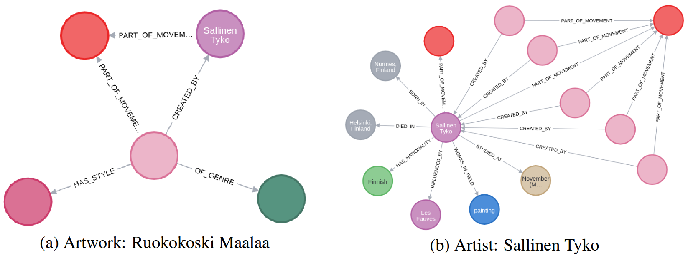
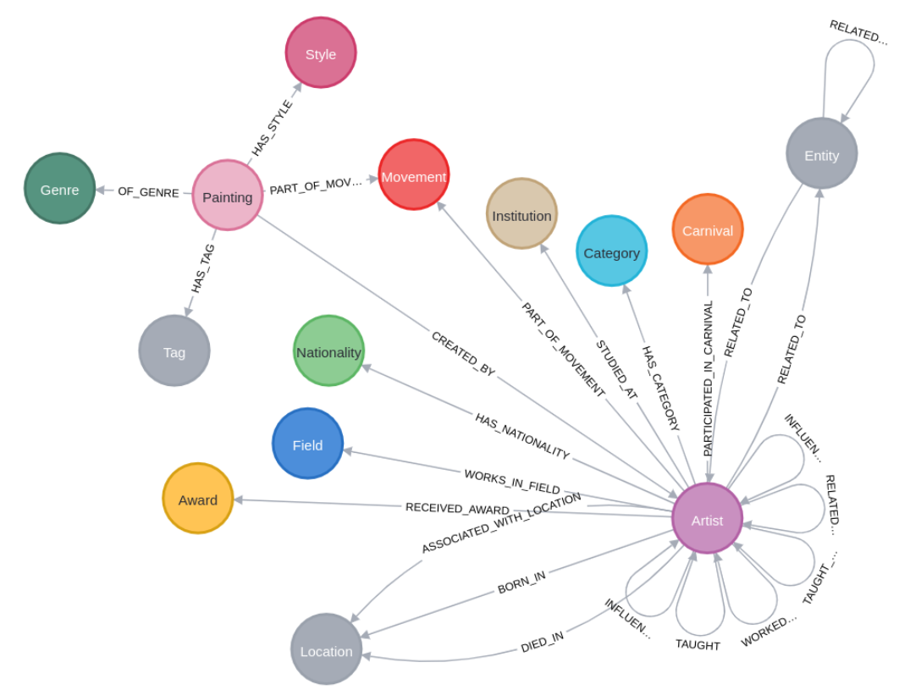

# FrED: Artistic Knowledge Graph (G_D)

This folder contains the data and schemas required to establish the **Artistic Knowledge Graph ($\mathcal{G}_D$)**. While the raw ArtBench-10 dataset provides visual features and basic style labels, this module injects the deep historical and structural context necessary for grounded attribution.

---

## 🏛️ Domain Modeling & KG Construction

We transform the flat vision dataset into a relational network by aggregating metadata across two primary levels:
1.  **Painting-Level Metadata:** Mapping images to explicit genres, styles, artistic movements, and descriptive tags via WikiArt.
2.  **Artist-Level Metadata:** Capturing biographical data, active years, geographical associations, and interpersonal lineages (influences, teachers, and collaborators) via Wikipedia and DBpedia.

### 🖼️ Structural Mapping Example
The framework establishes a mathematical bridge between visual features and topological nodes. For example, two visually distinct paintings may be linked structurally if their creators studied under the same master or belonged to the same movement.

  
   
  <em>Figure: Visualization of a Painting node (Ruokokoski Maalaa) and its creator (Sallinen Tyko) within the KG, showing the interconnected portfolio and historical metadata.</em>

---

## 📂 Data Structure

The following files represent the multi-stage enrichment strategy used to transform vision data into a relational network:

*   **`artbench_full_metadata.json`**: Comprehensive painting-level metadata for ArtBench-10 samples retrieved via the WikiArt API.
*   **`wikiart_artist_metadata.json`**: Collected metadata for all artists in the dataset, including active years and thematic tags.
*   **`artist_wiki_pages/`**: Raw biographical summaries and historical descriptions for artists extracted from Wikipedia.
*   **`artist_knowledge_graphs/`**: Structured relational data (SPARQL query results) from DBpedia capturing interpersonal networks and geographical data.

---

## 🛠️ Ontological Schema (Neo4j)

The KG is instantiated in **Neo4j** to optimize for traversing highly interconnected historical data. The schema centers on two anchor nodes: `Painting` and `Artist`.

### Schema Visualization

  
   
  <em>Figure: Ontological schema of G_D, illustrating the directed relationships between artists, styles, genres, and movements.</em>

