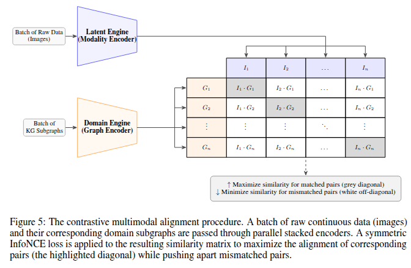

# FrED: Contrastive Learning & Representation Alignment

This folder contains the implementation and resources for the **Contrastive Learning** module of the FrED framework. This component serves as the mathematical bridge between continuous visual features and discrete structural knowledge (KGs). 

The primary goal of this module is to map generated artifacts and training data into a **unified semantic space**, enabling direct Bayesian attribution by aligning latent distributions of disparate modalities.

---

## 🏗️ Methodology Overview

To evaluate generative outputs against our Domain KG, we establish a shared vector space ($d_e = 512$) inspired by the CLIP architecture. This alignment ensures that the attribution is grounded in structural reality by allowing direct cosine similarity measurements between pixels and graph nodes.

### Multimodal Alignment Process
Our approach utilizes parallel encoders and non-linear projection heads governed by a **Symmetric InfoNCE Loss**. This objective maximizes the mutual information between visual textures and structural graph signatures.

*(Note: Replace the URL above with the actual path to your image once uploaded to GitHub)*

### Encoder Architectures
*   **Visual Encoding (Latent Engine):** We utilize the **ViT-g-14** architecture. Its large-scale pre-training provides the discriminative depth necessary to capture complex stylistic characteristics and ensure predictive faithfulness.
*   **Structural Encoding (Domain Engine):** Domain metadata is stored in **Neo4j** and encoded using **Node2Vec**. This approach captures both local stylistic details and global historical context, ensuring the structural prior accurately reflects topological rarity in the art-historical network.

---

## 📂 File & Folder Descriptions

| File/Folder | Description |
| :--- | :--- |
| **`projection_heads/`** | Contains the final trained MLP weights used to map unimodal embeddings into the joint multimodal space. |
| **`train_mpls.py`** | The core training script for the projection heads using the Symmetric InfoNCE (CLIP-style) loss. |
| **`extract_openclip_embeddings.py`** | Utility script to extract high-dimensional visual features using the ViT-g-14 model. |
| **`image_embeddings_vit_g_14.npy`** | Pre-computed latent embeddings for the training dataset extracted via OpenCLIP. |
| **`node2vec_embeddings.npy`** | Pre-computed structural embeddings extracted from the Neo4j Knowledge Graph. |

---
