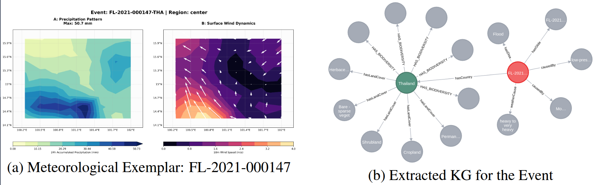
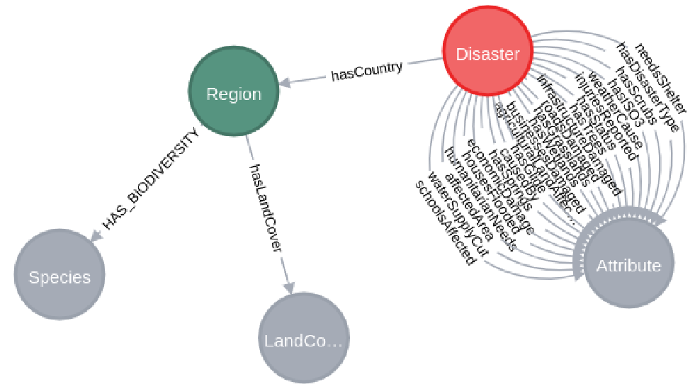

# FrED: Environmental Knowledge Graph (G_E)

This folder contains the data and schemas required to establish the **Environmental Knowledge Graph ($\mathcal{G}_E$)**. This graph bridges the scale mismatch between coarse $0.25^\circ$ meteorological grids and localized geographical features, enabling high-resolution data attribution for global flood events.

---

## 🏛️ Domain Modeling & Source Integration

We construct $\mathcal{G}_E$ by projecting grid-level predictions into a rich semantic space. Each flood event is anchored by precise GPS coordinates, allowing us to link meteorological states to two primary layers of external knowledge:

1.  **Biological Layer (iNaturalist):** Verified taxonomic data (Species, Genus, Kingdom) retrieved within a 10km radius of each flood center. These act as sensitive indicators of regional climate micro-zones.
2.  **Geographic Layer (ESA WorldCover):** 10m-resolution land-cover distribution (tree cover, urban areas, mangroves, etc.) within a 10km buffer. This identifies the physical surface characteristics that influence disaster severity.

### 🌊 Environmental Exemplar
Unlike the artistic domain, the environmental domain utilizes **Direct Geospatial Matching**. Since every forecast has a coordinate and timestamp, we can immediately query the graph for the exact environmental footprint.

  
   
  <em>Figure: (a) Meteorological data for flood event FL-2021-000147. (b) The corresponding extracted environmental subgraph showing local regional hubs and physical signatures.</em>

---

## 📂 Folder Structure

*   **`extreme_floods_updated.json`**: The foundational registry of global flood events (sourced from ExtremeKG), including GPS coordinates, temporal footprints, and macroscopic impact metrics.
*   **`flood_event_species/`**: A collection of biological observations retrieved from the iNaturalist database for each localized flood region.
*   **`queries_for_floods.txt`**: A repository of Cypher/SPARQL queries used to instantiate and traverse the Environmental KG within Neo4j.

---

## 🛠️ Ontological Schema (Neo4j)

The schema is centered on the **Disaster** event as the primary temporal anchor, spatially linked to **Region** hubs.

### Schema Visualization

  
   
  <em>Figure: Ontological schema of G_E, illustrating the relationships between disasters, biological species, and physical land-cover classes.</em>

### Relationship Inventory
| Source Node | Relationship Edge | Target Node | Key Metadata |
| :--- | :--- | :--- | :--- |
| `Disaster` | `hasCountry` | `Region` | iso3, name |
| `Region` | `Has_Biodiversity` | `Species` | observations, scientificName |
| `Region` | `hasLandCover` | `LandCoverClass` | area_km2, name |
| `Disaster` | `affectedArea` | `Attribute` | displacement, damage |

---

## 📊 Semantic Diversity
The graph contains over **18,000 biodiversity edges** across nearly **10,000 unique species**, alongside detailed land-cover zonal statistics. This high-density network ensures that attribution is grounded in "structural reality," linking weather predictions to physically consistent historical analogs.
