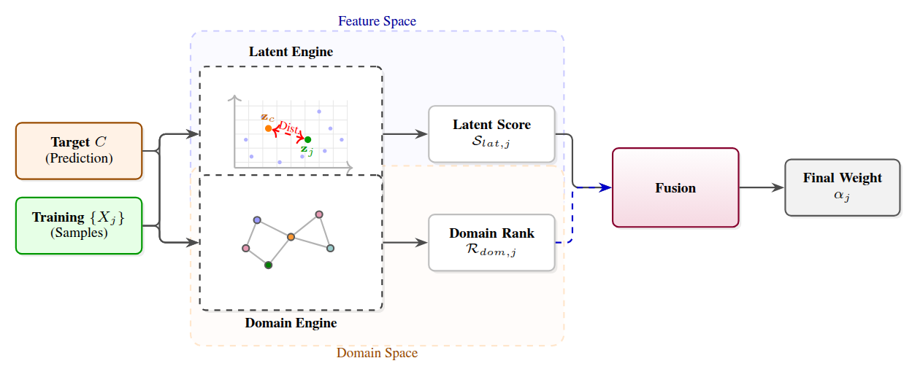

# FrED: A Framework for External and Domain-Aware Influence Analysis in Generative AI

---

## 📄 Abstract
The rapid deployment of generative AI has amplified the critical need for Training Data Attribution to ensure transparency and accountability. However, current parametric approaches require computationally prohibitive access to model weights, while similarity-based methods ignore deep structural context. We propose a novel probabilistic framework that operates entirely in a black-box setting. Our method fuses continuous feature similarities with discrete, domain-specific Knowledge Graphs (KGs). This approach ensures the attribution is grounded in structural reality, explicitly rewarding highly specific historical samples while preventing generic background data from dominating the results. 
We evaluate our framework across two distinct domains where attribution is inherently complex: **abstract artistic image synthesis** and **high-dimensional physical weather forecasting**. Extensive benchmarking demonstrates the robust efficacy of our approach. In the artistic domain, it achieves a Linear Datamodeling Score highly competitive with state-of-the-art gradient estimators. In the environmental domain, a comparative analysis of top-ranked historical weather events confirms the physical consistency of our attributions, successfully linking forecasts to meteorologically relevant past weather patterns. Operating entirely without internal model access, our approach offers an efficient, interpretable mechanism for auditing complex foundation models.

---

## 🖼️ Framework Overview

  
   
  <em>Figure: Overview of the FrED framework, illustrating the fusion of continuous feature similarity with discrete Domain Knowledge Graphs to produce grounded, black-box data attribution.</em>

---

## 📂 Project Structure

### 🎨 Art Experiments
This folder contains the implementation and datasets for the artistic domain.
* **Objective:** Evaluating attribution accuracy using Linear Datamodeling Scores.
* **Key Components:** Feature extraction from artistic styles, Knowledge Graph construction for art history, and benchmarking against gradient estimators.

### 🌍 Environmental Experiments
This folder contains the implementation for high-dimensional physical weather forecasting.
* **Objective:** Verifying the physical consistency of attributions in complex environmental models.
* **Key Components:** Processing of historical meteorological data, domain-aware KG for weather patterns, and comparative analysis of top-ranked physical events.